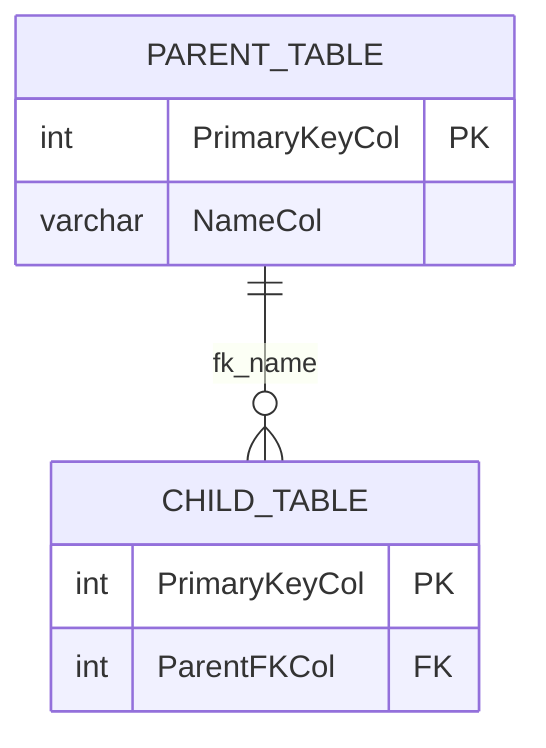

# /document Command

> Generate structured markdown documentation for a SQL Server database from system catalog views

## Usage

```
/document <database name or description>
```

## Examples

```
/document "document the AdventureWorks database"
/document "generate docs for all tables in the Sales schema"
/document "document the HR database including indexes and foreign keys"
/document "create a data dictionary for the reporting database"
/document "document stored procedures in the dbo schema"
```

---

## What This Skill Does

1. Runs catalog queries against SQL Server system views to extract schema metadata
2. Organizes the output into structured markdown sections (tables, columns, indexes, FKs, procedures)
3. Adds LLM-synthesized narrative for context — what each object likely represents
4. Writes the final documentation to `docs/generated/<database-name>.md`
5. Offers optional execution via `sqlcmd` for the catalog queries after confirmation

---

## Process

### Step 1: Clarify Scope

Ask the user (if not already specified):
- **Database name** — which database to document
- **Schema filter** — all schemas or specific ones (e.g., `dbo`, `Sales`)
- **Object types** — tables only, or also views, stored procedures, functions?
- **Level of detail** — full column-level detail or summary (table list + description only)?

Default if unspecified: all schemas, tables + views + procedures, full column detail.

---

### Step 2: Run Catalog Queries

Present each query as a copy-paste block, then ask: "Ready to run these queries? (yes/no)"

Only execute after explicit "yes". Use `$MSSQL_CONNECTION` if set; otherwise prompt for credentials.

#### 2a. Database Overview

```sql
SELECT
    d.name                          AS database_name,
    d.compatibility_level,
    d.collation_name,
    d.recovery_model_desc,
    d.state_desc,
    d.create_date,
    SUM(mf.size * 8 / 1024.0)      AS total_size_mb
FROM sys.databases d
JOIN sys.master_files mf ON d.database_id = mf.database_id
WHERE d.name = '<DatabaseName>'
GROUP BY d.name, d.compatibility_level, d.collation_name,
         d.recovery_model_desc, d.state_desc, d.create_date;
```

#### 2b. Tables and Row Counts

```sql
USE [<DatabaseName>];

SELECT
    s.name                          AS schema_name,
    t.name                          AS table_name,
    p.rows                          AS row_count,
    t.create_date,
    t.modify_date,
    ep.value                        AS description
FROM sys.tables t
JOIN sys.schemas s ON t.schema_id = s.schema_id
JOIN sys.partitions p ON t.object_id = p.object_id AND p.index_id IN (0, 1)
LEFT JOIN sys.extended_properties ep
    ON ep.major_id = t.object_id AND ep.minor_id = 0 AND ep.name = 'MS_Description'
ORDER BY s.name, t.name;
```

#### 2c. Column Details

```sql
USE [<DatabaseName>];

SELECT
    s.name                          AS schema_name,
    t.name                          AS table_name,
    c.column_id,
    c.name                          AS column_name,
    tp.name                         AS data_type,
    c.max_length,
    c.precision,
    c.scale,
    c.is_nullable,
    c.is_identity,
    dc.definition                   AS default_value,
    ep.value                        AS description
FROM sys.columns c
JOIN sys.tables t ON c.object_id = t.object_id
JOIN sys.schemas s ON t.schema_id = s.schema_id
JOIN sys.types tp ON c.user_type_id = tp.user_type_id
LEFT JOIN sys.default_constraints dc ON c.default_object_id = dc.object_id
LEFT JOIN sys.extended_properties ep
    ON ep.major_id = c.object_id AND ep.minor_id = c.column_id AND ep.name = 'MS_Description'
ORDER BY s.name, t.name, c.column_id;
```

#### 2d. Primary Keys

```sql
USE [<DatabaseName>];

SELECT
    s.name                          AS schema_name,
    t.name                          AS table_name,
    i.name                          AS pk_name,
    STRING_AGG(c.name, ', ')
        WITHIN GROUP (ORDER BY ic.key_ordinal) AS pk_columns
FROM sys.indexes i
JOIN sys.tables t ON i.object_id = t.object_id
JOIN sys.schemas s ON t.schema_id = s.schema_id
JOIN sys.index_columns ic ON i.object_id = ic.object_id AND i.index_id = ic.index_id
JOIN sys.columns c ON ic.object_id = c.object_id AND ic.column_id = c.column_id
WHERE i.is_primary_key = 1
GROUP BY s.name, t.name, i.name
ORDER BY s.name, t.name;
```

#### 2e. Foreign Keys

```sql
USE [<DatabaseName>];

SELECT
    s.name                          AS schema_name,
    tp.name                         AS parent_table,
    STRING_AGG(pc.name, ', ')
        WITHIN GROUP (ORDER BY fkc.constraint_column_id) AS parent_columns,
    fk.name                         AS fk_name,
    rs.name                         AS referenced_schema,
    rt.name                         AS referenced_table,
    STRING_AGG(rc.name, ', ')
        WITHIN GROUP (ORDER BY fkc.constraint_column_id) AS referenced_columns,
    fk.delete_referential_action_desc,
    fk.update_referential_action_desc
FROM sys.foreign_keys fk
JOIN sys.tables tp ON fk.parent_object_id = tp.object_id
JOIN sys.schemas s ON tp.schema_id = s.schema_id
JOIN sys.tables rt ON fk.referenced_object_id = rt.object_id
JOIN sys.schemas rs ON rt.schema_id = rs.schema_id
JOIN sys.foreign_key_columns fkc ON fk.object_id = fkc.constraint_object_id
JOIN sys.columns pc ON fkc.parent_object_id = pc.object_id AND fkc.parent_column_id = pc.column_id
JOIN sys.columns rc ON fkc.referenced_object_id = rc.object_id AND fkc.referenced_column_id = rc.column_id
GROUP BY s.name, tp.name, fk.name, rs.name, rt.name,
         fk.delete_referential_action_desc, fk.update_referential_action_desc
ORDER BY s.name, tp.name;
```

#### 2f. Indexes (non-PK)

```sql
USE [<DatabaseName>];

SELECT
    s.name                          AS schema_name,
    t.name                          AS table_name,
    i.name                          AS index_name,
    i.type_desc                     AS index_type,
    i.is_unique,
    STRING_AGG(c.name, ', ')
        WITHIN GROUP (ORDER BY ic.key_ordinal) AS key_columns,
    STRING_AGG(CASE WHEN ic.is_included_column = 1 THEN c.name END, ', ')
        WITHIN GROUP (ORDER BY ic.index_column_id) AS included_columns
FROM sys.indexes i
JOIN sys.tables t ON i.object_id = t.object_id
JOIN sys.schemas s ON t.schema_id = s.schema_id
JOIN sys.index_columns ic ON i.object_id = ic.object_id AND i.index_id = ic.index_id
JOIN sys.columns c ON ic.object_id = c.object_id AND ic.column_id = c.column_id
WHERE i.is_primary_key = 0 AND i.is_unique_constraint = 0 AND i.type > 0
GROUP BY s.name, t.name, i.name, i.type_desc, i.is_unique
ORDER BY s.name, t.name, i.name;
```

#### 2g. Views

```sql
USE [<DatabaseName>];

SELECT
    s.name                          AS schema_name,
    v.name                          AS view_name,
    v.create_date,
    v.modify_date,
    ep.value                        AS description,
    m.definition                    AS view_definition
FROM sys.views v
JOIN sys.schemas s ON v.schema_id = s.schema_id
LEFT JOIN sys.extended_properties ep
    ON ep.major_id = v.object_id AND ep.minor_id = 0 AND ep.name = 'MS_Description'
LEFT JOIN sys.sql_modules m ON v.object_id = m.object_id
ORDER BY s.name, v.name;
```

#### 2h. Stored Procedures and Functions

```sql
USE [<DatabaseName>];

SELECT
    s.name                          AS schema_name,
    o.name                          AS object_name,
    o.type_desc                     AS object_type,
    o.create_date,
    o.modify_date,
    ep.value                        AS description,
    m.definition
FROM sys.objects o
JOIN sys.schemas s ON o.schema_id = s.schema_id
JOIN sys.sql_modules m ON o.object_id = m.object_id
LEFT JOIN sys.extended_properties ep
    ON ep.major_id = o.object_id AND ep.minor_id = 0 AND ep.name = 'MS_Description'
WHERE o.type IN ('P', 'FN', 'IF', 'TF')
ORDER BY s.name, o.type_desc, o.name;
```

---

### Step 3: Build Markdown Document

Combine query results into a structured markdown file. Use this template:

```markdown
# Database Documentation: <DatabaseName>

> Generated: <date>  
> Server: <server>  
> Compatibility Level: <level> | Recovery Model: <model> | Collation: <collation>

---

## Overview

<LLM narrative: 2–3 sentences describing the database purpose inferred from schema names, table names, and object naming patterns. If nothing can be inferred, write "Purpose not determined from metadata.">

**Total size:** <size> MB  
**Schemas:** <comma-separated schema list>

---

## Table of Contents

- [Tables](#tables)
- [Views](#views)
- [Stored Procedures & Functions](#stored-procedures--functions)
- [Relationships Diagram](#relationships-diagram)

---

## Tables

### `<schema>.<table>`

> <LLM narrative: 1 sentence on likely purpose of this table, inferred from its name and column names. If uncertain, omit.>

**Row count:** <count> | **Created:** <date> | **Modified:** <date>

#### Columns

| Column | Type | Nullable | Identity | Default | Description |
|--------|------|----------|----------|---------|-------------|
| `<col>` | `<type>(<size>)` | Yes/No | Yes/No | `<default>` | <MS_Description or blank> |

#### Primary Key

`<pk_name>` → (`<col1>`, `<col2>`)

#### Foreign Keys

| FK Name | Columns | References | On Delete | On Update |
|---------|---------|------------|-----------|-----------|
| `<fk>` | `<col>` | `<schema>.<table>(<col>)` | <action> | <action> |

#### Indexes

| Index Name | Type | Unique | Key Columns | Included Columns |
|------------|------|--------|-------------|------------------|
| `<name>` | NONCLUSTERED | Yes/No | `<cols>` | `<cols>` |

---

## Views

### `<schema>.<view>`

> <LLM narrative: 1 sentence on what this view exposes.>

**Created:** <date> | **Modified:** <date>

<definition block if short (< 30 lines); otherwise note "See source definition">

---

## Stored Procedures & Functions

### `<schema>.<name>` *(STORED_PROCEDURE / SCALAR_FUNCTION / TABLE_VALUED_FUNCTION)*

> <LLM narrative: 1 sentence on what this routine does, inferred from its name and definition.>

**Created:** <date> | **Modified:** <date>

---

## Relationships Diagram

<Mermaid ER diagram — generate from FK data>


```

**LLM narrative rules:**
- Base all descriptions on actual column names, table names, and relationships — never invent domain facts
- If a table has an `MS_Description` extended property, use it verbatim; LLM narrative is a fallback only
- Mark inferred descriptions clearly with *(inferred)* when there is no extended property
- For procedures/functions, summarize the body in one sentence — don't reproduce it verbatim in the narrative

---

### Step 4: Output

1. Show a preview of the first table's section for user review
2. Ask: "Does this format look right? (yes/no)"
3. On confirmation, write the full document to `docs/generated/<database-name>.md`
   - If the file already exists: "Overwrite `docs/generated/<database-name>.md`? (yes/no)"
4. Print the file path so the user can open it immediately

---

## Output Rules

**Catalog queries (SELECT only — read-only):**
- Show the query, explain what it returns
- Offer: "Run via sqlcmd? (yes/no)"
- ONLY execute after explicit "yes"

**Generated markdown file:**
- Write to `docs/generated/<database-name>.md`
- Confirm overwrite if file exists
- Never write secrets or connection strings into the document

**Mermaid diagram:**
- Include only tables that have at least one FK relationship
- Cap at 20 tables in the diagram; for larger schemas, generate per-schema diagrams

---

## Connection Handling

Check `$MSSQL_CONNECTION` environment variable:
- If set: use it — format: `sqlcmd -S <server> -U <user> -P <pass> -d <database> -Q "<query>"`
- If not set: prompt — "Please provide: Server name, Username, Password, Database name"

Always show the exact `sqlcmd` command before running. Never run silently.

---

## Important Rules

- NEVER display or store passwords — reference `$MSSQL_CONNECTION` by name only
- NEVER run DDL or DML — all queries in this skill are SELECT-only catalog reads
- If `STRING_AGG` is not available (SQL Server < 2017), offer the `STUFF + FOR XML PATH` fallback
- Always check if `docs/generated/` directory exists before writing; if not, inform the user to create it
- For very large databases (> 200 tables), ask: "Generate per-schema documents or one combined file?"
