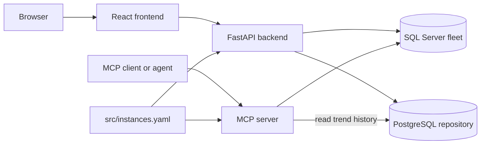

# Architecture

Data Eyes has two interfaces over the same SQL Server fleet:

- The dashboard serves people through a browser and performs fixed diagnostic
  queries through its backend.
- The MCP server serves agents through MCP and exposes guarded SQL and DBA
  tools.

They are one system because they share the fleet definition and history
repository. The dashboard does not proxy its live queries through MCP; each
service connects directly to the configured SQL Servers for its own workload.

## Runtime topology

## Component responsibilities

### Frontend

The React application presents fleet health, instance drill-down pages,
account administration, trends, Advisor findings, and the optional Ask
experience. Nginx serves the production build and routes browser traffic to the
backend. See [Dashboard](dashboard.md).

### Backend

The FastAPI backend owns browser-facing APIs, authentication, fixed SQL Server
diagnostics, severity evaluation, background collection, instance-registry
synchronization, and optional AI-generated explanations. It connects directly
to each monitored SQL Server with `pyodbc`.

### MCP server

The MCP server wraps SQL Server exploration and DBA diagnostics as structured
tools. It selects a connection by the `instance` argument, applies policy and
resource limits, and returns results to MCP clients. It can also read the trend
history written by the dashboard. See [MCP server](mcp.md).

### PostgreSQL repository

PostgreSQL is Data Eyes' internal state store, not a monitored database. It
stores users, encrypted instance registry entries, health history, wait
snapshots, blocking events, and Advisor dismissals. See
[Repository](repository.md).

### SQL Server fleet

These are the external systems being observed. Connections come from the
shared YAML file. Data Eyes is read-oriented by default; maintenance scripts
are separate, explicitly executed operational resources.

## End-to-end flows

### Startup and configuration

1. Docker Compose mounts the same `src/instances.yaml` file into the backend
   and MCP containers.
2. MCP reads that file as its live fleet registry.
3. The backend encrypts and upserts the YAML entries into PostgreSQL.
4. Entries created only through the dashboard remain in the dashboard registry,
   but they are not visible to MCP until added to the shared YAML.

### Live dashboard request

1. The browser requests fleet or instance data from FastAPI.
2. The backend reads the selected encrypted registry connection.
3. A fixed diagnostic query runs directly against that SQL Server.
4. The backend evaluates and returns structured health data to the frontend.

### MCP tool request

1. A client calls an MCP tool and optionally supplies an `instance` name.
2. MCP resolves the instance from the shared YAML.
3. Policy checks reject unsafe or oversized work.
4. MCP queries the selected SQL Server and returns structured output.

### Historical collection

1. The backend collector periodically evaluates every registered instance.
2. Severity, wait, resource-rate, and blocking snapshots are written to
   PostgreSQL.
3. The dashboard uses those rows for trends.
4. MCP repository tools can read the same history for agent analysis.

## Design boundaries

- `src/instances.yaml` is the cross-service source of truth for shared fleet
  membership.
- PostgreSQL is required application infrastructure; it must not point at a
  monitored SQL Server.
- Live dashboard diagnostics and live MCP calls are independent paths. An MCP
  outage does not prevent the dashboard from querying SQL Server, and vice
  versa.
- Agent-generated insights are optional. Core monitoring, authentication, and
  history do not require an AI API key.
